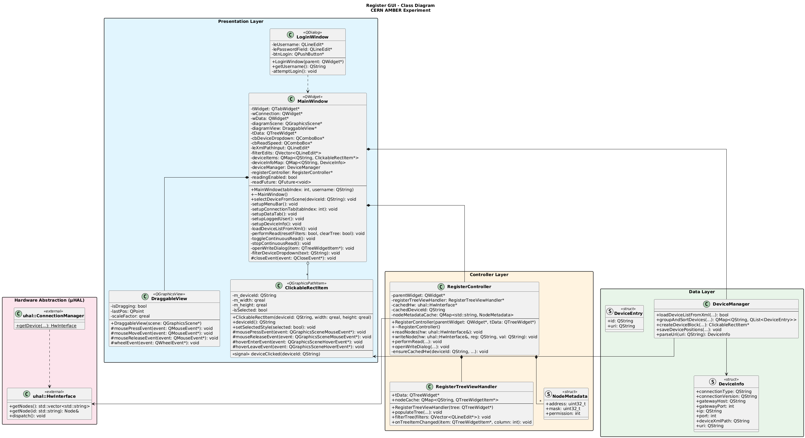
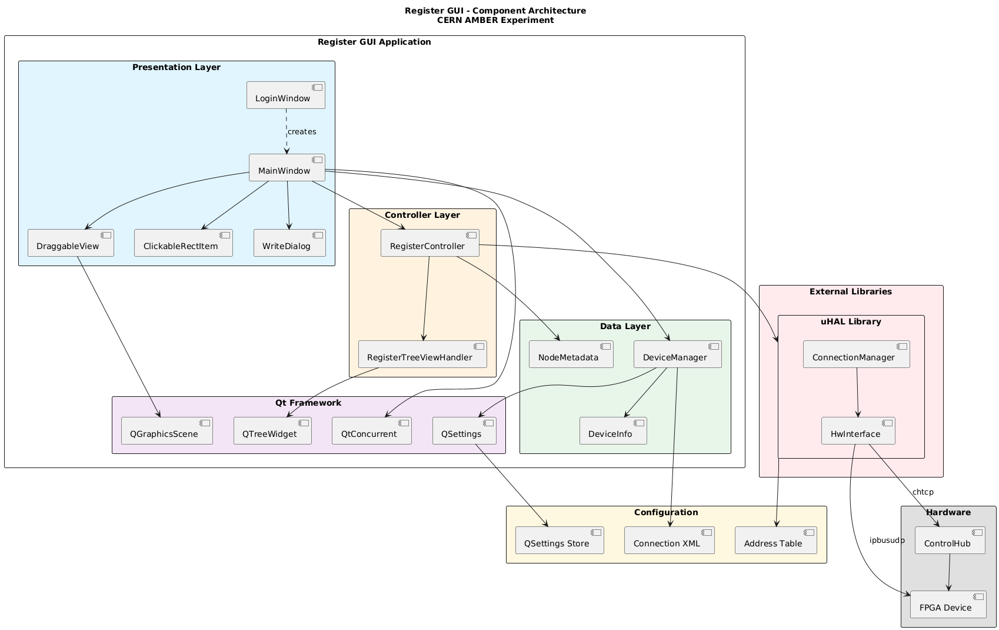
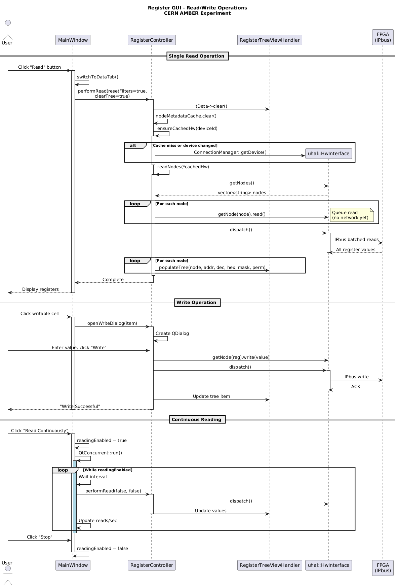
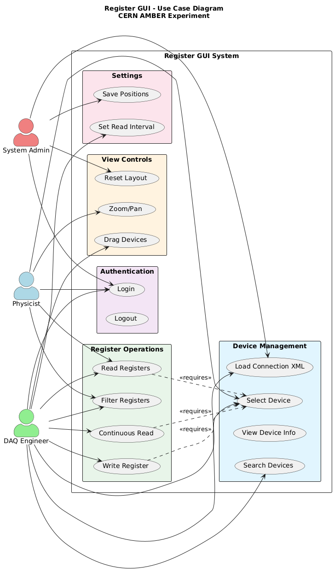
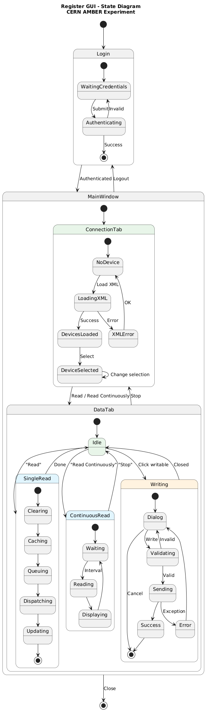
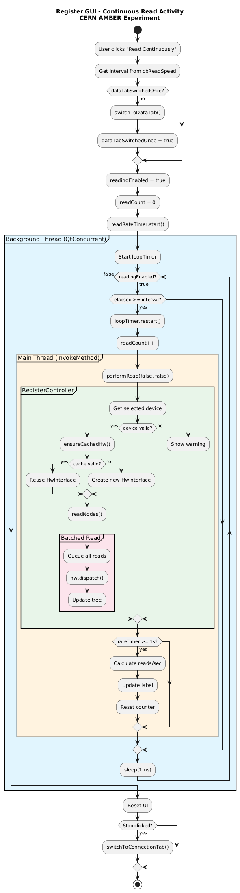

# Register GUI

A Qt-based graphical user interface for reading and writing hardware registers on FPGA-based devices using the **μHAL** (IPbus) protocol. Developed for the **CERN AMBER (NA66)** experiment.


## Overview

Register GUI is a desktop application designed to facilitate the configuration, monitoring, and control of hardware registers in FPGA modules used by the AMBER experiment's data acquisition system. The tool provides an intuitive interface for physicists and engineers to interact with detector electronics via the IPbus/μHAL protocol.

### About AMBER

The **AMBER** (Apparatus for Meson and Baryon Experimental Research) experiment is a fixed-target experiment at CERN's Super Proton Synchrotron (SPS), investigating fundamental questions in quantum chromodynamics (QCD), including proton charge radius measurement, antiproton production cross-sections, and meson structure studies.

## Features

- **Device Discovery**: Load device configurations from XML connection files
- **Visual Device Map**: Interactive diagram view with draggable device blocks
- **Register Tree View**: Hierarchical display of all device registers with filtering
- **Real-time Reading**: Single read or continuous polling with configurable intervals (10ms - 2min)
- **Register Writing**: Write dialog with hex/decimal conversion for writable registers
- **Connection Support**: IPbus direct and ControlHub (chtcp) gateway protocols
- **User Authentication**: Simple login system for access control
- **Persistent Settings**: Saves device positions, XML paths, and preferences

## Requirements

### Build Dependencies

- Qt 5.x or later
- C++17 compatible compiler
- μHAL (IPbus Software) library
- qmake build system

### μHAL Installation

```bash
# On CentOS/RHEL (CERN environment)
yum install ipbus-software-uhal

# Or build from source
git clone https://github.com/ipbus/ipbus-software.git
cd ipbus-software
make
```

## Installation

### Building from Source

```bash
# Clone the repository
git clone https://github.com/Loghic/Bachelor-Project.git
cd Bachelor-Project

# Build using qmake
qmake RegisterEditor.pro
make -j$(nproc)

# Run the application
./RegisterEditor
```

## Project Structure

```
Bachelor-Project/
├── include/
│   ├── mainwindow.h           # Main application window
│   ├── loginwindow.h          # User authentication dialog
│   ├── devicemanager.h        # Device XML parsing and management
│   ├── registercontroller.h   # μHAL read/write operations
│   ├── registertreeviewhandler.h  # Tree widget management
│   ├── clickablerectitem.h    # Interactive device blocks
│   └── draggableview.h        # Zoomable/pannable graphics view
├── src/
│   ├── main.cpp
│   ├── mainwindow.cpp
│   ├── loginwindow.cpp
│   ├── devicemanager.cpp
│   ├── registercontroller.cpp
│   ├── registertreeviewhandler.cpp
│   ├── clickablerectitem.cpp
│   └── draggableview.cpp
├── resources/
│   ├── style.qss              # Application stylesheet
│   └── resources.qrc          # Qt resource file
├── docs/
│   └── diagrams/              # UML diagrams (PlantUML)
├── RegisterEditor.pro         # Qt project file
└── README.md
```

## Usage

### 1. Login
Launch the application and authenticate with valid credentials.

### 2. Configure Connection
- Browse and select your XML connection file containing device definitions
- The device map will populate with available devices

### 3. Select Device
- Click on a device block in the diagram or use the dropdown
- Device information (IP, port, connection type) will be displayed

### 4. Read Registers
- **Single Read**: Click "Read" to fetch all register values once
- **Continuous Read**: Click "Read Continuously" to poll at the selected interval
- Use column filters to search registers by name, address, or value

### 5. Write Registers
- Click on any register with "Write" permission
- Enter new value in hex or decimal format
- Click "Write" to send to hardware

### View Controls
- **Zoom**: Mouse wheel or Ctrl+/Ctrl-
- **Pan**: Right-click and drag
- **Fit to Screen**: Ctrl+F
- **Center on Selected**: Ctrl+E

## Configuration File Format

The application expects an XML connection file in μHAL format:

```xml
<?xml version="1.0" encoding="UTF-8"?>
<connections>
    <connection id="device1"
                uri="chtcp-2.0://gateway:10203?target=192.168.1.100:50001"
                address_table="file:///path/to/device1_registers.xml"/>
    <connection id="device2"
                uri="ipbusudp-2.0://192.168.1.101:50001"
                address_table="file:///path/to/device2_registers.xml"/>
</connections>
```

## Supported Protocols

| Protocol | URI Format | Description |
|----------|------------|-------------|
| IPbus UDP | `ipbusudp-2.0://ip:port` | Direct UDP connection |
| ControlHub | `chtcp-2.0://gateway:port?target=ip:port` | Via ControlHub gateway |

---

## Architecture & UML Diagrams

### Class Diagram
Shows the structure of all classes, their attributes, methods, and relationships.



### Component Diagram
Illustrates the high-level component architecture and dependencies.



### Sequence Diagram
Demonstrates the flow of read/write operations between components.



### Use Case Diagram
Shows user roles (Physicist, DAQ Engineer, System Admin) and their interactions.



### State Diagram
Depicts application states and transitions.



### Activity Diagram
Details the continuous read operation flow with threading.



---

## Related Projects

- [AMBER Experiment](https://amber.web.cern.ch/) - Official AMBER collaboration
- [IPbus Software](https://github.com/ipbus/ipbus-software) - μHAL library
- [CERN IPbus](https://ipbus.web.cern.ch/) - IPbus documentation

## License

This project is developed as part of a Bachelor's thesis for the CERN AMBER experiment.

## Acknowledgments

- CERN AMBER Collaboration
- IPbus Development Team
- Czech Technical University in Prague

---

*Developed for the CERN AMBER (NA66) Experiment*
